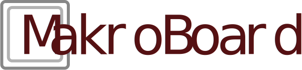

MakroBoard is an open source software solution to use any device capable of displaying a website as a remote macro keyboard for your Windows / Linux / Mac PC.
Its written in C#/dotnet for the API on the pc and the client which is also served by the c# app is written in [Dart](https://dart.dev) with the [Flutter](https://flutter.dev) framework.

Its currently under heavy development, so only use it for testing or development

Web and full documentation: [makroboard.app](https://makroboard.app)

Community: 

## Installation

There is no released version so far, you have to follow the development steps below

## Development

### Requirements

- IDE of your choise (We recommend VSCodium / VSCode / Visual Studio)
- [Dotnet 6.0 SDK](https://dotnet.microsoft.com/download/dotnet/6.0) for your OS
- [flutter](https://flutter.dev/docs/get-started/install) for your OS

### Optioal: Vscode Plugins

- dart-code.dart-code
- luanpotter.dart-import
- dart-code.flutter
- nash.awesome-flutter-snippets
- ms-dotnettools.csharp

You can install them with:

    code --install-extension dart-code.dart-code && \
    code --install-extension luanpotter.dart-import && \
    code --install-extension dart-code.flutter && \
    code --install-extension nash.awesome-flutter-snippets && \
    code --install-extension ms-dotnettools.csharp

### Building and starting the application

We recommend to open 2 instances of vscode (or one vscode and one vs instance), one in the root directory of the project and one in the makro_board_client directory.

- to install the flutter dependencies go to the makro_board_client folder and run `flutter pub get`
- to install the dotnet dependencies go to the projects root folder and run `dotnet restore`

- to run the client, go to the makro_board_client folder and run `flutter run` or if you have the vscode plugins open the instance where the makro_board_client directory is opened, open the `lib/main.dart' and press F5

- to run the host you can now just hit F5 or use the build tasks in the vscode / visual studio instance where your root project directory is opened to start the backend 
- you can also use the shell `dotnet build` or `dotnet publish` in the root of the project to start the backend

### Building the documentation

Currently you can only build the documentation on a Windows client. Install [docfx](https://dotnet.github.io/docfx/tutorial/docfx_getting_started.html#2-use-docfx-as-a-command-line-tool) via the prefered way, clone the MakroBoard repo, go with an administrative shell to the `Docs` folder and run `docfx --serve`. Then you can navigate with the prefered Webbrowser to `http://localhost:8080/`

## Structure

Control

- Actions - Key, Exec, ..., Makro(Ablauf von Actions), Selection
  - Key
  - Application
  - Makro
  - Selection
  - (HTTP/WS call)
  - Direct HTTP/WS call from client
- View
  - Text
  - If / Else Text
  - Image
  - If / Else Image
  - Material icons
  - If / Else Material icons
  - List
  - Interactive List
  - HTTP content
  - If / Else HTTP content

Panels

- Action
- Viewconfig

Pages

- Panels

Pagecollections

- Pages
- (show on which devices, default All)

## ControlDB Structure

- Pages
  - SymbolicName
  - Label
  * Group
    - SymbolicName
    - Label
    * Panel (Visualize Control)
      - PluginName
      - SymbolicName
      * ConfigParameter
        - SymbolicName
        - Value (any/string)

## Ideas / Todos

https://github.com/MakroBoard/MakroBoard/issues
